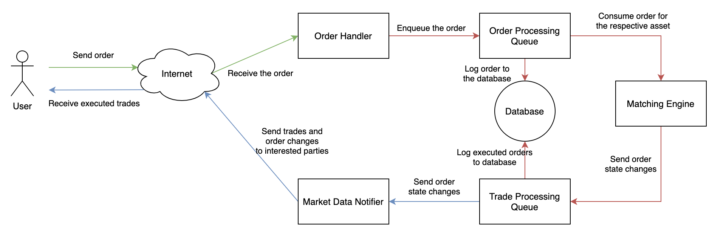

# Rust Exchange

A simple exchange built using Rust. The project uses microservices that work together to process buy and sell orders.

The project has the following services:

#### **Order Handler**

This is the service that will communicate with the users directly through a TCP connection using a simple protocol. The user connects to the service host and submits a payload through the socket. Once the order is successfully received (and logged), the user received a response. This communication should be fast (~10ms) as all the hard work (storing into the database and matching orders) will be done asynchronously.

The order handler will read the asset from the payload and it will enqueue the order to the correct queue - every asset should have its own queue.

The service won’t return whether the order was executed or not, it is not its responsibility. The user must register to the Market Data Notifier service to receive notifications about his order.

#### **Order Processing Queue**

The order receiver will log the request to the database and notify the correct Matching Engine that a new order message was received.

#### **Matching Engine**

The Matching Engine will consume the order messages and processes them. When a buy order matches one or more sell orders (or vice-versa), the Matching Engine sends the resulting trades to the Trade Processing Queue and updates the order book.

The order book is stored in memory to prevent I/O overheads like writing to the disk or waiting for a network request.

#### **Trade Processing Queue**

This service will receive messages from the Matching Engine about orders executed, canceled, or changed. The service will then log the message to the database and will dispatch a message to Market Data Notifier.

#### **Market Data Notifier**

This service will have thousands of users connected waiting for order notifications. The service will broadcast the trades for the users. Also, users can register to receive notifications about their own orders

## License

MIT
